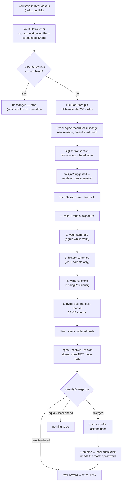

# Data Flow

Read [ARCHITECTURE.md](ARCHITECTURE.md) first — this document assumes you know
what a *revision*, the *DAG*, a *head*, and a *blob* are.

Here we follow the data itself: what enters the system, what each component does
to it, and what comes out the other end.

---

## The one-paragraph version

You save in KeePassXC. A file watcher notices, hashes the encrypted bytes, and
records them as a new revision whose parent is the previous head. That nudges the
app to sync. WebRTC carries the new revision's bytes to your other device, which
verifies the hash, stores the revision, sees that its own head is now an ancestor
of yours, fast-forwards, and writes the bytes to its own `.kdbx` file. If both
devices changed independently, no fast-forward is possible and a conflict is
raised for you to resolve — and only *that* path ever asks for your master
password.

---

## The main flow, end to end



---

## Step by step

### 1. Getting a vault into the system

Two entry points, and the difference matters:

- **Share** (`bindVault` → `SyncEngine.importVault`): you pick an existing
  `.kdbx`. Its current contents become the DAG's root revision, and a fresh vault
  id is minted.
- **Join** (`adoptVault`, driven by the session): this device holds nothing, so
  it takes the peer's vault **id and all**. Minting a new id here is precisely
  what would make the two copies permanently un-syncable — hence the `unrelated`
  divergence verdict existing at all.

### 2. Detecting a local change

`VaultFileWatcher` (chokidar) watches the vault path. This is harder than "watch
a file" for three reasons the code calls out:

- A KeePassXC save is not one event — it writes a temp file and renames it over
  the vault, so one save surfaces as unlink-then-add, often several events. Hence
  debouncing and re-reading the file fresh afterwards.
- The `.kdbx.lock` file lives in the same directory and churns constantly, so
  only the vault path itself is watched.
- A read can still lose a race with the rename, so a failed read is retried once.

Then `recordLocalChange` hashes the bytes and compares against the head's hash.
**Identical bytes are a no-op** — without this the history would fill with
duplicate revisions every time a watcher fired spuriously.

### 3. Connecting two devices

This is where the external services appear.

**Pairing (first time).** Device A calls `POST /rooms` on the signaling server
and gets a `roomId` + `inviteToken`. It builds a **pairing offer** — a
`passvault://pair?...` URL carrying its public key, name, and the room details —
and trades it for an eight-character **short code** via `POST /pairing-codes`.
The code is single-use and lives ten minutes.

Device B types the code. `readPairingCode` redeems it with
`GET /pairing-codes/<code>`, decodes the offer, and both devices now know the
same room.

> The code may be qualified as `4F7K-2QX9@sync.example.org`. A bare code is only
> meaningful to the server that issued it; the suffix says where to redeem it,
> which is what lets two devices configured with *different* servers still pair.

**Reconnecting (afterwards).** The room is remembered in the `device_rendezvous`
table. Both devices rejoin the same room; the signaling server recreates an empty
room on demand, so whichever arrives first simply waits. The invite token still
has to match, and even if it didn't, an intruder would fail the key check.

**Establishing the pipe.** `PeerBridge` (renderer) opens a WebSocket to
`/signal`, joins the room, and exchanges WebRTC offers/answers and ICE candidates
through the server. STUN discovers a route through NAT; a TURN relay is used only
if configured and only when a direct route fails. Two ordered data channels open:
`passvault/control` and `passvault/bulk`.

**What the signaling server sees:** room membership and opaque SDP/ICE blobs. It
never sees vault bytes, revision ids, device names, or credentials.

### 4. The sync session

Runs in the **main process** (`services.runSession`), with bytes relayed over IPC
to the renderer's data channels. Both devices run identical code.

| Phase | Message | What it settles |
| --- | --- | --- |
| 1 | `hello` | Protocol version, device id, public key, a challenge nonce |
| 2 | `auth` | A signature over the *peer's* nonce — proof of live key possession |
| 3 | `vault-summary` | Which vault this is about; an empty side adopts the other's |
| 4 | `history-summary` | Every revision id and its parents — **no bytes** |
| 5 | `want-revisions` | Topologically ordered, parents first |
| 6 | `revision-header` + chunks | Bytes on the bulk channel |
| 7 | `revision-ack` | Accepted, or rejected with a reason |
| 8 | `sync-complete` | Both sides finished |

Two things are worth pausing on.

**Nothing about the vault — not even its id — is exchanged before both sides have
proven possession of a pinned key.** Phase 3 cannot happen until phases 1–2
succeed.

**Phase 4 is the whole trick.** The history summary contains ids, hashes, sizes,
and parent links — enough to compute the merge base and the missing set purely
from graph shape. That is why the entire decision layer runs on ciphertext.

### 5. Moving the bytes

`serve()` splits a revision into 64 KiB chunks. Each chunk is a binary frame:

```
bytes 0..4   transferSeq  uint32 big-endian
bytes 4..8   chunkIndex   uint32 big-endian
bytes 8..    payload
```

`transferSeq` is a session-scoped counter rather than a 36-character revision id —
four bytes instead of thirty-six, on every single chunk. The control channel's
`revision-header` maps it back before any chunk arrives.

**Backpressure.** Before each chunk, if the channel's `bufferedAmount` exceeds
1 MB the sender awaits `drain()`. Without this, a loop pushing a multi-megabyte
vault outruns SCTP and the connection is torn down under it. The signal
originates at the real `RTCDataChannel` in the renderer and is reported back
across IPC, so throttling reflects the network rather than how fast IPC happens
to be.

**Reassembly.** `ChunkAssembler` tracks which indices arrived rather than
appending blindly, so duplicates are idempotent, out-of-order frames are fine,
and a missing frame is caught at completion instead of producing silently
truncated bytes. Because control and bulk are separate streams, chunks can beat
their header; up to 64 such "orphan" frames are held and replayed once the header
lands.

### 6. Ingesting

`ingestReceivedRevision` enforces three rules, in order:

1. Bytes are hashed and compared against the declared hash before anything is
   written.
2. Every declared parent must already be stored — a dangling edge would make the
   DAG answer ancestry questions incorrectly.
3. **The sender's declared parents and revision id are kept verbatim.** Stamping
   the local head onto a revision authored elsewhere produces a graph that is
   structurally valid and historically false; regenerating the id makes "do I
   already have this?" unanswerable and forces a full re-send every connection.

Ingesting deliberately **does not move the head**. What to do about an incoming
revision is a separate decision, made after divergence is classified.

### 7. Deciding, and writing back

After the session, `classifyDivergence` gives its verdict:

- **`remote-ahead`** → `fastForward`. Nothing is discarded, so there is nothing
  to ask the user about.
- **`diverged`** → open a conflict row and surface it in the UI.

Either way `materializeCurrentVersion()` makes the file on disk match the head.
It compares hashes first and does nothing if they already agree, so repeat calls
are free.

Writing is atomic: temp file **in the same directory** (rename is only atomic
within a filesystem), `fsync`, then rename. A crash leaves either the old
complete file or the new one, never a half-written vault.

It also **refuses to write while `<vault>.kdbx.lock` exists**. That lock is
advisory, but overwriting underneath a running KeePassXC risks it saving its own
in-memory copy back over yours moments later, silently discarding a merge. When
held back, a 2-second poll retries until the lock clears.

---

## Secondary flows

### Authentication and trust

`evaluateTrust` returns one of four verdicts, and each has a distinct
consequence:

| Verdict | Behaviour |
| --- | --- |
| `trusted` | Accept, update `last_seen_at` |
| `unknown-device` | Accept **only** in pairing mode, and only after a human confirms the six digits |
| `revoked` | Reject — this is what "Disconnect" produces |
| `key-mismatch` | Reject; same id, different key means a reinstall *or* an impersonation attempt, and both need deliberate re-pairing |

Note the naming: the UI's **Disconnect** sets the internal trust state to
`revoked`, which is reversible — the key stays pinned, so **Reconnect** puts it
straight back. **Forget** is the irreversible one; it deletes the pinned key and
the rendezvous.

### Error reporting, and who refused whom

Protocol errors carry a load-bearing prefix:

- `peer rejected:` — **this** device turned the other away.
- `peer reported:` — the **other** device turned this one away.

`explainFailure` in `main/services.ts` uses that prefix to translate internal
vocabulary into a sentence that says which device did what. Without it, both
screens showed the same "device has been revoked", which described something far
more final than pressing Disconnect and told neither user which end to fix.

### Background behaviour

Four things happen without anyone pressing a button:

1. **The file watcher** turns a KeePassXC save into a revision and triggers a
   sync.
2. **Standing rendezvous** — at startup the app rejoins the room of the most
   recently paired device, so a peer pressing "Sync now" finds it already there.
3. **Peer-initiated sessions** — if a `hello` arrives while this side is idle,
   `IpcPeerLinkHub` buffers it (max 8 frames) and calls `onPeerInitiated`, which
   starts a session to answer. Without this the initiator waited for a reply the
   idle side would never send, and gave up 30 seconds later complaining about a
   missing hello. **Only a `hello` opens a session** — answering a trailing frame
   from a finished session would start one whose own trailing frames start
   another, and the two devices would volley sessions indefinitely.
4. **Unlock polling** — while an update is held back by KeePassXC's lock file, a
   2-second timer retries.

### The one flow that decrypts

Combining a fork is the only path that needs your master password. It goes:

`combineAndUse` → `SyncEngine.merge` → `KdbxInterpreter.merge` → `kdbxweb`

Inside the boundary: both databases are opened, `localDb.merge(incomingDb)` runs
KDBX's own entry-level merge, the result is saved back to encrypted bytes, and
then **re-opened to verify it can still be read** — bytes that merged but cannot
be reopened would be silently unrecoverable once promoted.

Only encrypted bytes come back out. The password is never persisted anywhere, and
even the diff summary returns *field names only*, never values.

### Session failure

Every wait in a session is bounded (30 s normally, 5 minutes during pairing,
because a person comparing two screens is slower than a network). Malformed input
from a peer fails the session rather than the process — the protocol parser
enforces hard caps on everything a peer can make you allocate, and the DAG
validator rejects duplicate ids and cycles before any of it reaches storage.

---

## Where data lives

| Location | Contents |
| --- | --- |
| `<appdata>/blobs/<aa>/<sha256>.kdbx` | Encrypted revision bytes |
| `<appdata>/tmp/` | In-flight writes, swept at startup |
| `<appdata>/metadata.db` | Revision DAG, device trust, rendezvous, settings |
| `<appdata>/device-identity.json` | Ed25519 private key, encrypted via the OS keychain, mode `0600`, **deliberately outside** the database so it never travels with a backup |
| Your chosen path | The `.kdbx` KeePassXC opens |
| Signaling server | Room membership and pairing codes, in memory, forgotten on restart |
